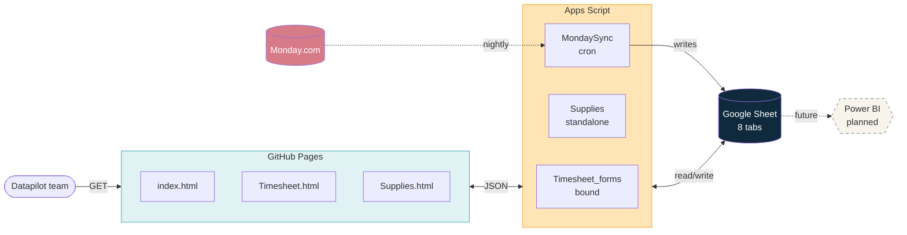

## Live

The system is deployed and in active use. URLs are kept in the team's shared Datapilot space, not in this public README.

| Page | Purpose |
|---|---|
| Landing | Index of available forms | https://datapilot-gitenvironmennt.github.io/Datapilot-Forms/ |
| Timesheet | Weekly timesheet | https://datapilot-gitenvironmennt.github.io/Datapilot-Forms/Timesheet.html |
| Supplies | Office supplies request | https://datapilot-gitenvironmennt.github.io/Datapilot-Forms/Supplies.html |

---

## Architecture



Full architecture and flow diagrams in [Technical_Handover.docx](./docs/Technical_Handover.docx).

---

## Repo layout

```
.
├── index.html                Landing page
├── Timesheet.html            Weekly timesheet form
├── Supplies.html             Office supplies request form
├── brand-elements/           Logo, favicon, decorative PNGs
```

---

## Stack

| Layer | Tech | Notes |
|---|---|---|
| Hosting | GitHub Pages | Static HTML, served from `main` branch |
| Back-end | Google Apps Script | Two projects: `Timesheet_forms` (bound to Sheet), `Supplies` (standalone) |
| Database | Google Sheets | 8 tabs, see `Technical Handover` |
| Upstream | Monday.com | Synced nightly |
| Email | Gmail (via Apps Script) | Sent from the role-based maintainer account |
| Reporting | Power BI | Planned, not built |

---

## Deploy

### Front-end (HTML / CSS / client JS)

```sh
git add Timesheet.html
git commit -m "fix: dropdown width on mobile"
git push origin main
```

GitHub Pages picks up the change in ~1 min. Users hard-refresh (<kbd>Ctrl</kbd>+<kbd>F5</kbd> / <kbd>Cmd</kbd>+<kbd>Shift</kbd>+<kbd>R</kbd>) to bypass cache.

### Back-end (Apps Script)

1. Open the Apps Script project (link below).
2. Edit `Code.gs` or `MondaySync.gs`. Save with <kbd>Ctrl</kbd>+<kbd>S</kbd>.
3. **Deploy → Manage deployments → ✏️ → New version → Deploy.**

Web App URL stays stable across redeploys. No front-end change needed unless the endpoint shape changes.

### Apps Script projects

| Project | URL |
|---|---|
| `Timesheet_forms` (bound) | Open via the Sheet → Extensions → Apps Script |
| `Supplies` (standalone) | https://script.google.com/home (filter by owner) |

---

## Data

### Google Sheet

| Tab | Writer | Reader | Notes |
|---|---|---|---|
| `Consolidated` | Timesheet form | Power BI* | 1 row per timesheet entry |
| `Projects` | MondaySync | Both forms | Cached from Monday, refreshed nightly |
| `TeamDirectory` | MondaySync | Both forms | Active users only |
| `NextWeekPlanning` | Timesheet form | Power BI* | Heads-up rollup |
| `SuppliesRequests` | Supplies form, onEdit trigger | Office manager | 1 row per item |
| `AdHocExamples` | Manual | (none) | Reference only, not surfaced in form |
| `FAQ` | Manual | Timesheet form | Q&A panel content |
| `_SyncLog` | MondaySync | Developers | Hidden by default |


### Project classification

```
Monday group title contains  →  type
─────────────────────────────────────────────────
"ad-hoc" / "ad hoc" / "adhoc"   →  adhoc
"régie" / "regie" / "maintenance" →  regie
"projets actifs" / "sprint"     →  sprint
(anything else)                  →  autre  ← data-only, not shown in form
```

The form renders sections for `sprint`, `regie`, `adhoc`. `autre` is tracked in the Sheet for completeness but doesn't appear in the UI. Logic: `MondaySync.classifyGroup()`.

---

## Common tasks

| Task | Where |
|---|---|
| Add a new project | Monday board, group `Projets Actifs` / `Régies / Maintenance` / `Ad-hoc` |
| Add/remove a team member | Monday admin panel |
| Edit the FAQ | Sheet → `FAQ` tab |
| Force a Monday sync now | Sheet → menu **Monday Sync → Sync everything** |
| Read sync history | Sheet → `_SyncLog` tab (unhide first) |
| Update a supplies request status | Sheet → `SuppliesRequests` tab → Status cell |


---

## Troubleshooting

| Symptom | First check |
|---|---|
| Form won't load | Hard-refresh, then GitHub Pages status |
| Project missing from dropdown | Monday group correct? Statut `En cours`? Then run a manual sync |
| No recap email after submit | Spam folder. Then Apps Script execution log |
| Sync hasn't run | `_SyncLog` tab. If stale, trigger needs re-creation under owner account |
| Status update email from wrong sender | Web App was deployed under a different identity. Redeploy under owner |

Decision tree on Operations_Manual

---

## Maintainer

| | |
|---|---|
| Owner | Role-based Datapilot account (consultant@datapilo.fr) |
|  Developer | Nevaj Sunnassy |
| GitHub repo | Datapilot organization |


---

## Docs

| File | Audience | When to read |
|---|---|---|
| [Technical_Handover.docx](./docs/Technical_Handover.docx) | Developers | Picking up the project, extending it, debugging |
| [Operations_Manual.docx](./docs/Operations_Manual.docx) | Project leads, office manager | Learning how to operate the system |
| [Quick_Reference.docx](./docs/Quick_Reference.docx) | Same as above | Doing a task right now |

---
